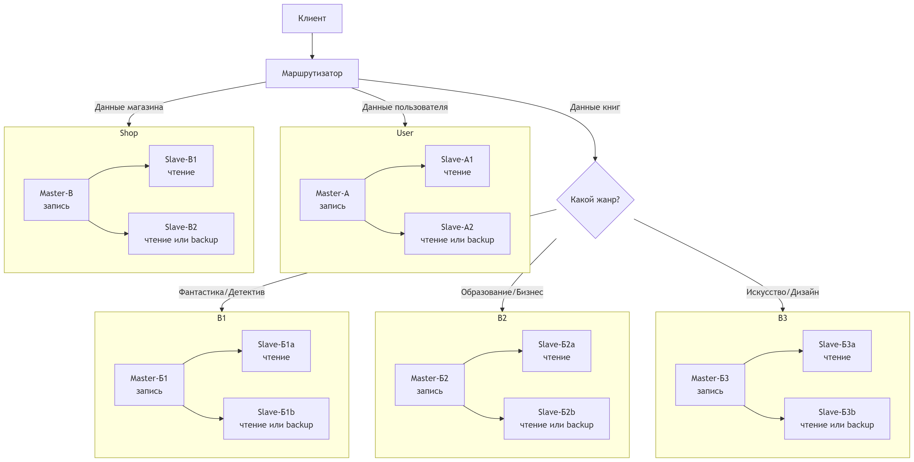

# Домашнее задание к занятию "`Репликация и масштабирование. Часть 2`" - `Доготер Егор`

### Задание 1. 

#### Опишите основные преимущества использования масштабирования методами:

1. `Активный master-сервер и пассивный репликационный slave-сервер;`
2. `master-сервер и несколько slave-серверов;`

### Ответ 1. 

1. Активный master-сервер и пассивный репликационный slave-сервер

* **Отказоустойчивость**
* **Резервное копирование без нагрузки на Master**
* **Обслуживание без простоев**
* **Тестирование производительности**

2. Master-сервер и несколько slave-серверов

* **Балансировка нагрузки чтения**
* **Выделенные задачи для разных Slave**
* **Географическая распределенность**
* **Снижение конкуренции за ресурсы**

---

### Задание 2.

#### Разработайте план для выполнения горизонтального и вертикального шаринга базы данных. База данных состоит из трёх таблиц:

1. `Пользователи;`
2. `Книги;`
3. `Магазины (столбцы произвольно).`

#### Опишите принципы построения системы и их разграничение или разбивку между базами данных.Пришлите блоксхему, где и что будет располагаться. Опишите, в каких режимах будут работать сервера.

### Предположим у нас следующий фомрат таблиц:

### Таблица 1: `users` (Пользователи)

| Поле | Тип данных | Описание |
|------|------------|----------|
| `user_id` | INT (PRIMARY KEY) | Уникальный идентификатор пользователя |
| `email` | VARCHAR (UNIQUE) | Электронная почта |
| `first_name` | VARCHAR | Имя |
| `last_name` | VARCHAR | Фамилия |

### Таблица 2: `books` (Книги)

| Поле | Тип данных | Описание |
|------|------------|----------|
| `book_id` | INT (PRIMARY KEY) | Уникальный идентификатор книги |
| `title` | VARCHAR | Название |
| `author` | VARCHAR | Автор |
| **`genre`** | **VARCHAR** | **Жанр (ключ шардинга)** |

### Таблица 3: `shops` (Магазины)

| Поле | Тип данных | Описание |
|------|------------|----------|
| `shop_id` | INT (PRIMARY KEY) | Уникальный идентификатор магазина |
| `name` | VARCHAR | Название магазина |
| `address` | VARCHAR | Адрес |
| `city` | VARCHAR | Город |

### Вертикальный шардинг (разделение по смыслу)
#### Шард распредяляет входящие запросы по серверам

| Сервер | Хранит | Отвечает за |
|--------|--------|-------------|
| **Сервер А** | Таблица `users` | Пользователей |
| **Сервер Б** | Таблица `books` | Книги |
| **Сервер В** | Таблица `shops` | Магазины |

### Вертикальный шардинг (разделение по смыслу)
#### Таблица `books` разбита на 3 части по **жанрам**:

| Шард | Жанры | Сервер |
|------|-------|--------|
| **Шард 1** | Фантастика, Детективы | Сервер Б1 |
| **Шард 2** | Образование, Бизнес | Сервер Б2 |
| **Шард 3** | Искусство, Дизайн | Сервер Б3 |

### Шардинг для репликации
#### Вторые slave можно использовать под backup

| Сервер | Master | Slave |
|--------|---------------------------|----------------------|
| Сервер А | Master-A | Slave-A1, Slave-A2 |
| Сервер Б1 | Master-Б1 | Slave-Б1a, Slave-Б1b |
| Сервер Б2 | Master-Б2 | Slave-Б2a, Slave-Б2b |
| Сервер Б3 | Master-Б3 | Slave-Б3a, Slave-Б3b |
| Сервер В | Master-В | Slave-В1, Slave-В2 |

#### Примерная блок-схема

